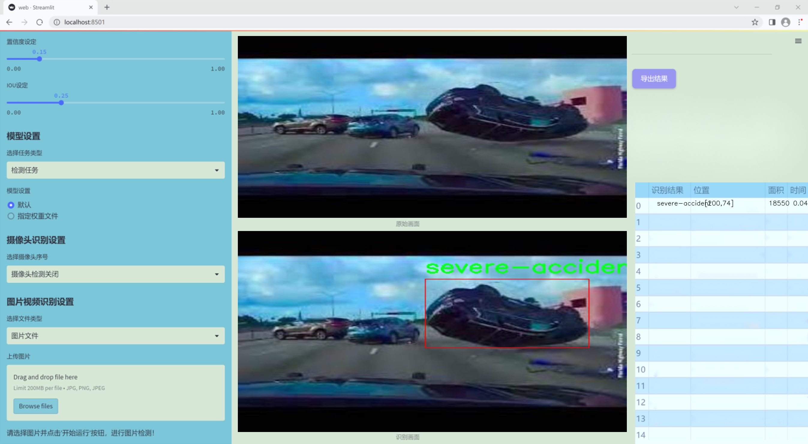
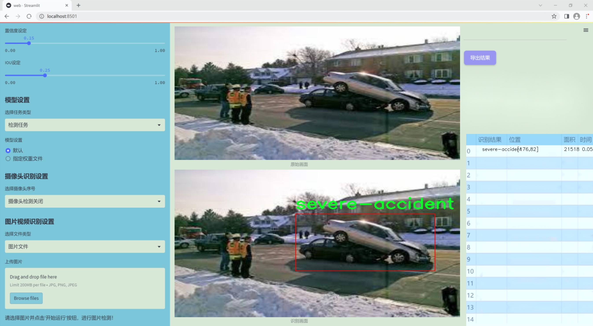
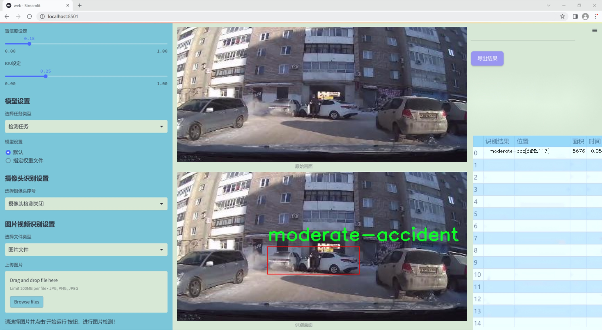
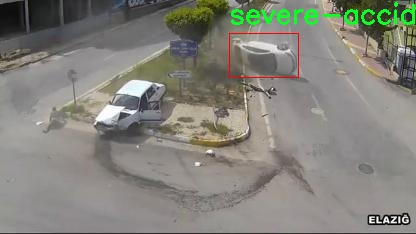
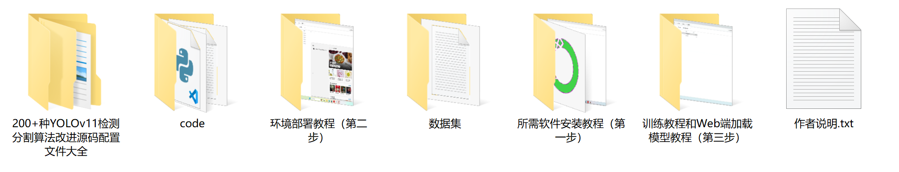

# 改进yolo11-ASF-DySample等200+全套创新点大全：交通事故严重程度检测系统源码＆数据集全套

### 1.图片效果展示







##### 项目来源 **[人工智能促进会 2024.11.01](https://kdocs.cn/l/cszuIiCKVNis)**

注意：由于项目一直在更新迭代，上面“1.图片效果展示”和“2.视频效果展示”展示的系统图片或者视频可能为老版本，新版本在老版本的基础上升级如下：（实际效果以升级的新版本为准）

  （1）适配了YOLOV11的“目标检测”模型和“实例分割”模型，通过加载相应的权重（.pt）文件即可自适应加载模型。

  （2）支持“图片识别”、“视频识别”、“摄像头实时识别”三种识别模式。

  （3）支持“图片识别”、“视频识别”、“摄像头实时识别”三种识别结果保存导出，解决手动导出（容易卡顿出现爆内存）存在的问题，识别完自动保存结果并导出到tempDir中。

  （4）支持Web前端系统中的标题、背景图等自定义修改。

  另外本项目提供训练的数据集和训练教程,暂不提供权重文件（best.pt）,需要您按照教程进行训练后实现图片演示和Web前端界面演示的效果。

### 2.视频效果展示

[2.1 视频效果展示](https://www.bilibili.com/video/BV1XDDAYAEMr/)

### 3.背景

研究背景与意义

随着城市化进程的加快，交通事故的发生频率逐年上升，给社会带来了巨大的经济损失和人身伤害。根据相关统计数据，交通事故不仅造成了数以万计的人员伤亡，还给国家和社会的医疗系统带来了沉重的负担。因此，如何有效地检测和评估交通事故的严重程度，成为了交通管理和公共安全领域亟待解决的重要课题。传统的交通事故分析方法往往依赖于人工调查和现场勘查，效率低下且容易受到主观因素的影响，难以实现实时监测和快速响应。

在此背景下，基于深度学习的计算机视觉技术逐渐成为交通事故检测领域的研究热点。YOLO（You Only Look Once）系列模型因其高效的实时目标检测能力而受到广泛关注。YOLOv11作为该系列的最新版本，具备更强的特征提取能力和更快的推理速度，能够在复杂的交通场景中实现对事故类型的准确识别。然而，现有的YOLOv11模型在交通事故严重程度的分类上仍存在一定的局限性，尤其是在不同类型事故的细微差别识别方面。

为了解决这一问题，本研究提出了一种基于改进YOLOv11的交通事故严重程度检测系统。该系统将利用一个包含5200张图像的SEVERITY-ACCIDENT-DETECTION数据集，该数据集涵盖了中度事故、物体事故和严重事故三类，旨在通过深度学习算法提高对交通事故严重程度的检测精度。通过对YOLOv11模型的改进，我们期望能够提升模型在不同事故类型上的识别能力，从而为交通管理部门提供更为精准的事故评估依据，进而降低交通事故带来的社会成本，提高公众的交通安全意识。这一研究不仅具有重要的理论意义，还有助于推动智能交通系统的发展，提升城市交通管理的智能化水平。

### 4.数据集信息展示

##### 4.1 本项目数据集详细数据（类别数＆类别名）

nc: 3
names: ['moderate-accident', 'object-accident', 'severe-accident']


该项目为【目标检测】数据集，请在【训练教程和Web端加载模型教程（第三步）】这一步的时候按照【目标检测】部分的教程来训练

##### 4.2 本项目数据集信息介绍

本项目数据集信息介绍

本项目所使用的数据集名为“SEVERITY-ACCIDENT-DETECTION -FINALIZED”，旨在为改进YOLOv11的交通事故严重程度检测系统提供高质量的训练数据。该数据集包含三种主要类别，分别为“moderate-accident”（中等严重事故）、“object-accident”（物体事故）和“severe-accident”（严重事故）。这些类别的划分不仅考虑了事故的直接影响，还综合了事故发生时的环境因素、涉及的车辆数量以及事故造成的伤害程度，从而为模型的训练提供了多维度的视角。

数据集的构建过程经过精心设计，确保了样本的多样性和代表性。每个类别的样本均来源于真实的交通事故场景，涵盖了不同的天气条件、时间段以及道路类型。这种多样性使得模型在训练过程中能够学习到不同类型事故的特征，进而提高其在实际应用中的准确性和鲁棒性。此外，数据集中的每个样本都经过标注，确保了类别信息的准确性和一致性，为模型的训练提供了可靠的基础。

在数据预处理阶段，数据集还进行了必要的增强处理，以提升模型的泛化能力。这包括图像的旋转、缩放、裁剪等操作，旨在模拟各种可能的场景变化，从而使得训练后的模型能够更好地适应不同的实际情况。通过使用“SEVERITY-ACCIDENT-DETECTION -FINALIZED”数据集，我们期望能够有效提升YOLOv11在交通事故严重程度检测任务中的性能，为智能交通系统的建设提供更为坚实的技术支持。





### 5.全套项目环境部署视频教程（零基础手把手教学）

[5.1 所需软件PyCharm和Anaconda安装教程（第一步）](https://www.bilibili.com/video/BV1BoC1YCEKi/?spm_id_from=333.999.0.0&vd_source=bc9aec86d164b67a7004b996143742dc)


[5.2 安装Python虚拟环境创建和依赖库安装视频教程（第二步）](https://www.bilibili.com/video/BV1ZoC1YCEBw?spm_id_from=333.788.videopod.sections&vd_source=bc9aec86d164b67a7004b996143742dc)

### 6.改进YOLOv11训练教程和Web_UI前端加载模型教程（零基础手把手教学）

[6.1 改进YOLOv11训练教程和Web_UI前端加载模型教程（第三步）](https://www.bilibili.com/video/BV1BoC1YCEhR?spm_id_from=333.788.videopod.sections&vd_source=bc9aec86d164b67a7004b996143742dc)


按照上面的训练视频教程链接加载项目提供的数据集，运行train.py即可开始训练



     Epoch   gpu_mem       box       obj       cls    labels  img_size
     1/200     20.8G   0.01576   0.01955  0.007536        22      1280: 100%|██████████| 849/849 [14:42<00:00,  1.04s/it]
               Class     Images     Labels          P          R     mAP@.5 mAP@.5:.95: 100%|██████████| 213/213 [01:14<00:00,  2.87it/s]
                 all       3395      17314      0.994      0.957      0.0957      0.0843

     Epoch   gpu_mem       box       obj       cls    labels  img_size
     2/200     20.8G   0.01578   0.01923  0.007006        22      1280: 100%|██████████| 849/849 [14:44<00:00,  1.04s/it]
               Class     Images     Labels          P          R     mAP@.5 mAP@.5:.95: 100%|██████████| 213/213 [01:12<00:00,  2.95it/s]
                 all       3395      17314      0.996      0.956      0.0957      0.0845

     Epoch   gpu_mem       box       obj       cls    labels  img_size
     3/200     20.8G   0.01561    0.0191  0.006895        27      1280: 100%|██████████| 849/849 [10:56<00:00,  1.29it/s]
               Class     Images     Labels          P          R     mAP@.5 mAP@.5:.95: 100%|███████   | 187/213 [00:52<00:00,  4.04it/s]
                 all       3395      17314      0.996      0.957      0.0957      0.0845


###### [项目数据集下载链接](https://kdocs.cn/l/cszuIiCKVNis)

### 7.原始YOLOv11算法讲解


##### YOLOv11三大损失函数

YOLOv11（You Only Look Once）是一种流行的目标检测算法，其损失函数设计用于同时优化分类和定位任务。YOLO的损失函数通常包括几个部分：
**分类损失、定位损失（边界框回归损失）和置信度损失** 。其中，

  1. box_loss（边界框回归损失）是用于优化预测边界框与真实边界框之间的差异的部分。

  2. cls_loss（分类损失）是用于优化模型对目标类别的预测准确性的部分。分类损失确保模型能够正确地识别出图像中的对象属于哪个类别。

  3. dfl_loss（Distribution Focal Loss）是YOLO系列中的一种损失函数，特别是在一些改进版本如YOLOv5和YOLOv7中被引入。它的主要目的是解决目标检测中的类别不平衡问题，并提高模型在处理小目标和困难样本时的性能。

##### 边界框回归损失详解

box_loss（边界框回归损失）是用于优化预测边界框与真实边界框之间的差异的部分。


##### box_loss 的具体意义


##### 为什么需要 box_loss

  * 精确定位：通过最小化中心点坐标损失和宽高损失，模型能够更准确地预测目标的位置和大小。
  * 平衡不同类型的目标：使用平方根来处理宽高损失，可以更好地平衡不同大小的目标，确保小目标也能得到足够的关注。
  * 稳定训练：适当的损失函数设计有助于模型的稳定训练，避免梯度爆炸或消失等问题。

##### 分类损失详解

在YOLO（You Only Look
Once）目标检测算法中，cls_loss（分类损失）是用于优化模型对目标类别的预测准确性的部分。分类损失确保模型能够正确地识别出图像中的对象属于哪个类别。下面是关于cls_loss的详细解读：

##### 分类损失 (cls_loss) 的具体意义

  
分类损失通常使用交叉熵损失（Cross-Entropy
Loss）来计算。交叉熵损失衡量的是模型预测的概率分布与真实标签之间的差异。在YOLO中，分类损失的具体形式如下：


##### 为什么需要 cls_loss

  * 类别识别：cls_loss 确保模型能够正确识别出图像中的目标属于哪个类别。这对于目标检测任务至关重要，因为不仅需要知道目标的位置，还需要知道目标的类型。

  * 多类别支持：通过最小化分类损失，模型可以处理多个类别的目标检测任务。例如，在道路缺陷检测中，可能需要识别裂缝、坑洞、路面破损等多种类型的缺陷。

  * 提高准确性：分类损失有助于提高模型的分类准确性，从而提升整体检测性能。通过优化分类损失，模型可以更好地学习不同类别之间的特征差异。

##### 分布损失详解

`dfl_loss`（Distribution Focal
Loss）是YOLO系列中的一种损失函数，特别是在一些改进版本如YOLOv5和YOLOv7中被引入。它的主要目的是解决目标检测中的类别不平衡问题，并提高模型在处理小目标和困难样本时的性能。下面是对`dfl_loss`的详细解读：

##### DFL Loss 的背景

在目标检测任务中，类别不平衡是一个常见的问题。某些类别的样本数量可能远远多于其他类别，这会导致模型在训练过程中对常见类别的学习效果较好，而对罕见类别的学习效果较差。此外，小目标和困难样本的检测也是一个挑战，因为这些目标通常具有较少的特征信息，容易被忽略或误分类。

为了应对这些问题，研究者们提出了多种改进方法，其中之一就是`dfl_loss`。`dfl_loss`通过引入分布焦点损失来增强模型对困难样本的关注，并改善类别不平衡问题。

##### DFL Loss 的定义

DFL Loss
通常与传统的交叉熵损失结合使用，以增强模型对困难样本的学习能力。其核心思想是通过对每个类别的预测概率进行加权，使得模型更加关注那些难以正确分类的样本。

DFL Loss 的公式可以表示为：


##### DFL Loss 的具体意义**

  * **类别不平衡：** 通过引入平衡因子 α，DFL Loss 可以更好地处理类别不平衡问题。对于少数类别的样本，可以通过增加其权重来提升其重要性，从而提高模型对这些类别的检测性能。
  *  **困难样本：** 通过聚焦参数 γ，DFL Loss 可以让模型更加关注那些难以正确分类的样本。当 
  * γ 较大时，模型会对那些预测概率较低的样本给予更多的关注，从而提高这些样本的分类准确性。
  *  **提高整体性能** ：DFL Loss 结合了传统交叉熵损失的优势，并通过加权机制增强了模型对困难样本的学习能力，从而提高了整体的检测性能。


### 8.200+种全套改进YOLOV11创新点原理讲解

#### 8.1 200+种全套改进YOLOV11创新点原理讲解大全

由于篇幅限制，每个创新点的具体原理讲解就不全部展开，具体见下列网址中的改进模块对应项目的技术原理博客网址【Blog】（创新点均为模块化搭建，原理适配YOLOv5~YOLOv11等各种版本）

[改进模块技术原理博客【Blog】网址链接](https://gitee.com/qunmasj/good)


#### 8.2 精选部分改进YOLOV11创新点原理讲解

###### 这里节选部分改进创新点展开原理讲解(完整的改进原理见上图和[改进模块技术原理博客链接](https://gitee.com/qunmasj/good)【如果此小节的图加载失败可以通过CSDN或者Github搜索该博客的标题访问原始博客，原始博客图片显示正常】

### ParC融合位置感知循环卷积简介
ParC：Position aware circular convolution


#### Position aware circular convolution
针对于全局信息的提取作者提出了Position aware circular convolution（也称作Global Circular Convolution）。图中左右实际是对于该操作水平竖直两方向的对称，理解时只看左边即可。对于维度为C*H*W的输入，作者先将维度为C*B*1的Position Embedding通过双线性插值函数F调整到适合input的维度C*H*1（以适应不同特征大小输入），并且将PE水平复制扩展到C*H*W维度与输入特征相加。这里作者将PE直接设置成为了可学习的参数。

接下来参考该博客将加入PE的特征图竖直方向堆叠，并且同样以插值的方式得到了适应输入维度的C*H*1大小的卷积核，进行卷积操作。对于这一步卷积，作者将之称为循环卷积，并给出了一个卷积示意图。


但个人感觉实际上这个示意图只是为了说明为什么叫循环卷积，对于具体的计算细节还是根据公式理解更好。


进一步，作者给出了这一步的伪代码来便于读者对这一卷积的理解：y=F.conv2D（torch.cat（xp，xp，dim=2），kV），实际上就是将xp堆叠之后使用了一个“条形（或柱形）”卷积核进行简单的卷积操作。（但这样会导致多一次重复卷积，因此在堆叠示意图中只取了前2*H-1行）

可以看到在示意图中特征维度变化如下：C*(2H-1)*W ---C*H*1--->C*H*W，作者特意带上了通道数，并且并没有出现通道数的改变，那么这里所进行的卷积应该是depth wise卷积，通过对文章后续以及论文源码的阅读可以得知这一步进行的就是DW卷积。（we introduce group convolution and point wise convolution into these modules, which decreases number of parameters without hurting performance.）


由groups = channel可知使用的是DW卷积
通过上面就完成了一次竖直方向的全局信息交流，同样只要在水平方向进行同样的操作即可做到水平方向的全局信息交流。

#### ParC block

通过ParC成功解决了全局信息提取的问题，接下来就是针对2）3）两点进行改进。首先是Meta-Former模块，Meta-Former由Token Mixer和Channel Mixer构成，ParC首先满足了Token Mixer的全局信息提取的要求，并且相较于Attention在计算成本上更低。


这里①中的PWC即point wise conv，进一步验证了我们前面对于深度可分离卷积的想法，而GCC-H/V即是前面所说的ParC-H/V。

①构建了Meta-Former中的Token mixer模块，那么最后剩下的问题就是3），替换掉Attention模块之后模型不再data driven。为了解决这一点作者给出了一个channel wise attention，先将特征图（x,C*H*W）进行global average（a,C*1*1）并输入一个MLP生成一个channel wise的权重（w,C*1*1），再将权重与特征图在通道方向相乘得到输出（output = wx,C*H*W）。

#### ParC net
对于ParC net 的搭建，作者直接基于MobileViT，采用了分叉结构（c）完成了网络的搭建。


具体而言作者保留了MobileViT中浅层具有局部感受野的MobileNetV2结构，而将网络深层的ViT block替换成了ParC block，使网络变成了一个pure ConvNet。


### 9.系统功能展示

图9.1.系统支持检测结果表格显示

  图9.2.系统支持置信度和IOU阈值手动调节

  图9.3.系统支持自定义加载权重文件best.pt(需要你通过步骤5中训练获得)

  图9.4.系统支持摄像头实时识别

  图9.5.系统支持图片识别

  图9.6.系统支持视频识别

  图9.7.系统支持识别结果文件自动保存

  图9.8.系统支持Excel导出检测结果数据


### 10. YOLOv11核心改进源码讲解

#### 10.1 kan_conv.py

以下是对代码中最核心部分的提取和详细注释：

```python
import torch
import torch.nn as nn

class KANConvNDLayer(nn.Module):
    def __init__(self, conv_class, norm_class, input_dim, output_dim, spline_order, kernel_size,
                 groups=1, padding=0, stride=1, dilation=1,
                 ndim: int = 2, grid_size=5, base_activation=nn.GELU, grid_range=[-1, 1], dropout=0.0):
        super(KANConvNDLayer, self).__init__()
        
        # 初始化参数
        self.inputdim = input_dim  # 输入维度
        self.outdim = output_dim    # 输出维度
        self.spline_order = spline_order  # 样条的阶数
        self.kernel_size = kernel_size  # 卷积核大小
        self.padding = padding  # 填充
        self.stride = stride  # 步幅
        self.dilation = dilation  # 膨胀
        self.groups = groups  # 分组卷积的组数
        self.ndim = ndim  # 数据的维度（1D, 2D, 3D）
        self.grid_size = grid_size  # 网格大小
        self.base_activation = base_activation()  # 基础激活函数
        self.grid_range = grid_range  # 网格范围

        # 初始化 dropout
        self.dropout = None
        if dropout > 0:
            if ndim == 1:
                self.dropout = nn.Dropout1d(p=dropout)
            elif ndim == 2:
                self.dropout = nn.Dropout2d(p=dropout)
            elif ndim == 3:
                self.dropout = nn.Dropout3d(p=dropout)

        # 检查 groups 参数的有效性
        if groups <= 0:
            raise ValueError('groups must be a positive integer')
        if input_dim % groups != 0:
            raise ValueError('input_dim must be divisible by groups')
        if output_dim % groups != 0:
            raise ValueError('output_dim must be divisible by groups')

        # 初始化基础卷积层
        self.base_conv = nn.ModuleList([conv_class(input_dim // groups,
                                                   output_dim // groups,
                                                   kernel_size,
                                                   stride,
                                                   padding,
                                                   dilation,
                                                   groups=1,
                                                   bias=False) for _ in range(groups)])

        # 初始化样条卷积层
        self.spline_conv = nn.ModuleList([conv_class((grid_size + spline_order) * input_dim // groups,
                                                     output_dim // groups,
                                                     kernel_size,
                                                     stride,
                                                     padding,
                                                     dilation,
                                                     groups=1,
                                                     bias=False) for _ in range(groups)])

        # 初始化归一化层
        self.layer_norm = nn.ModuleList([norm_class(output_dim // groups) for _ in range(groups)])

        # 初始化 PReLU 激活函数
        self.prelus = nn.ModuleList([nn.PReLU() for _ in range(groups)])

        # 生成样条网格
        h = (self.grid_range[1] - self.grid_range[0]) / grid_size
        self.grid = torch.linspace(
            self.grid_range[0] - h * spline_order,
            self.grid_range[1] + h * spline_order,
            grid_size + 2 * spline_order + 1,
            dtype=torch.float32
        )

        # 使用 Kaiming 均匀分布初始化卷积层权重
        for conv_layer in self.base_conv:
            nn.init.kaiming_uniform_(conv_layer.weight, nonlinearity='linear')

        for conv_layer in self.spline_conv:
            nn.init.kaiming_uniform_(conv_layer.weight, nonlinearity='linear')

    def forward_kan(self, x, group_index):
        # 进行基础卷积操作
        base_output = self.base_conv[group_index](self.base_activation(x))

        # 扩展维度以进行样条操作
        x_uns = x.unsqueeze(-1)
        target = x.shape[1:] + self.grid.shape
        grid = self.grid.view(*list([1 for _ in range(self.ndim + 1)] + [-1, ])).expand(target).contiguous().to(x.device)

        # 计算样条基
        bases = ((x_uns >= grid[..., :-1]) & (x_uns < grid[..., 1:])).to(x.dtype)

        # 计算多阶样条基
        for k in range(1, self.spline_order + 1):
            left_intervals = grid[..., :-(k + 1)]
            right_intervals = grid[..., k:-1]
            delta = torch.where(right_intervals == left_intervals, torch.ones_like(right_intervals),
                                right_intervals - left_intervals)
            bases = ((x_uns - left_intervals) / delta * bases[..., :-1]) + \
                    ((grid[..., k + 1:] - x_uns) / (grid[..., k + 1:] - grid[..., 1:(-k)]) * bases[..., 1:])
        bases = bases.contiguous()
        bases = bases.moveaxis(-1, 2).flatten(1, 2)

        # 进行样条卷积操作
        spline_output = self.spline_conv[group_index](bases)
        x = self.prelus[group_index](self.layer_norm[group_index](base_output + spline_output))

        # 应用 dropout
        if self.dropout is not None:
            x = self.dropout(x)

        return x

    def forward(self, x):
        # 将输入按组分割
        split_x = torch.split(x, self.inputdim // self.groups, dim=1)
        output = []
        for group_ind, _x in enumerate(split_x):
            y = self.forward_kan(_x.clone(), group_ind)
            output.append(y.clone())
        y = torch.cat(output, dim=1)  # 合并输出
        return y
```

### 代码说明
1. **KANConvNDLayer**: 这是一个自定义的多维卷积层，支持任意维度（1D, 2D, 3D）。它结合了基础卷积和样条卷积，能够处理复杂的输入数据。
   
2. **初始化方法**: 在初始化中，设置了输入输出维度、卷积参数、激活函数等，并初始化了基础卷积层、样条卷积层、归一化层和激活函数。

3. **forward_kan 方法**: 该方法执行实际的前向传播，首先通过基础卷积层处理输入，然后计算样条基，最后通过样条卷积层处理样条基，并将两者的输出相加。

4. **forward 方法**: 该方法将输入数据按组分割，并对每一组调用 `forward_kan` 方法，最后将所有组的输出合并。

通过这种设计，KANConvNDLayer 能够灵活地处理不同维度的输入，并利用样条卷积增强模型的表达能力。

这个文件定义了一个名为 `KANConvNDLayer` 的神经网络层，旨在实现一种基于样条插值的卷积操作。它是一个可扩展的多维卷积层，支持一维、二维和三维卷积。该层的设计包含了多个参数，允许用户根据需求自定义卷积的行为。

在 `KANConvNDLayer` 的构造函数中，首先初始化了一些卷积层所需的参数，包括输入和输出维度、样条的阶数、卷积核大小、分组数、填充、步幅、扩张率等。接着，检查了分组数的有效性，并确保输入和输出维度可以被分组数整除。

该层使用 `nn.ModuleList` 来创建基础卷积层和样条卷积层。基础卷积层使用用户指定的卷积类（如 `nn.Conv1d`、`nn.Conv2d` 或 `nn.Conv3d`），而样条卷积层则根据样条阶数和网格大小构建。层归一化和激活函数（PReLU）也被应用于每个分组。

在 `forward_kan` 方法中，输入首先经过基础卷积层的激活函数处理，然后进行线性变换。接着，计算样条基函数，这些基函数用于生成样条卷积的输入。样条基函数的计算涉及到输入值与网格之间的关系，确保能够正确地应用样条插值。最后，经过样条卷积层、层归一化和激活函数的处理后，输出结果。

`forward` 方法负责将输入张量按组进行拆分，并依次调用 `forward_kan` 方法处理每个组的输入，最后将所有组的输出拼接在一起。

此外，文件中还定义了三个子类 `KANConv1DLayer`、`KANConv2DLayer` 和 `KANConv3DLayer`，分别用于一维、二维和三维卷积。这些子类通过调用父类的构造函数，传入相应的卷积类和归一化类，从而实现了对不同维度卷积的支持。

整体来看，这个文件实现了一个灵活且功能强大的卷积层，结合了基础卷积和样条插值的优点，适用于多种深度学习任务。

#### 10.2 lsknet.py

以下是代码中最核心的部分，并附上详细的中文注释：

```python
import torch
import torch.nn as nn
from functools import partial

class Mlp(nn.Module):
    """多层感知机（MLP）模块"""
    def __init__(self, in_features, hidden_features=None, out_features=None, act_layer=nn.GELU, drop=0.):
        super().__init__()
        out_features = out_features or in_features  # 输出特征数默认为输入特征数
        hidden_features = hidden_features or in_features  # 隐藏层特征数默认为输入特征数
        self.fc1 = nn.Conv2d(in_features, hidden_features, 1)  # 第一层卷积
        self.dwconv = DWConv(hidden_features)  # 深度卷积
        self.act = act_layer()  # 激活函数
        self.fc2 = nn.Conv2d(hidden_features, out_features, 1)  # 第二层卷积
        self.drop = nn.Dropout(drop)  # Dropout层

    def forward(self, x):
        """前向传播"""
        x = self.fc1(x)  # 第一层卷积
        x = self.dwconv(x)  # 深度卷积
        x = self.act(x)  # 激活
        x = self.drop(x)  # Dropout
        x = self.fc2(x)  # 第二层卷积
        x = self.drop(x)  # Dropout
        return x

class Attention(nn.Module):
    """注意力模块"""
    def __init__(self, d_model):
        super().__init__()
        self.proj_1 = nn.Conv2d(d_model, d_model, 1)  # 投影层1
        self.activation = nn.GELU()  # 激活函数
        self.spatial_gating_unit = LSKblock(d_model)  # 空间门控单元
        self.proj_2 = nn.Conv2d(d_model, d_model, 1)  # 投影层2

    def forward(self, x):
        """前向传播"""
        shortcut = x.clone()  # 保存输入以进行残差连接
        x = self.proj_1(x)  # 投影层1
        x = self.activation(x)  # 激活
        x = self.spatial_gating_unit(x)  # 空间门控
        x = self.proj_2(x)  # 投影层2
        x = x + shortcut  # 残差连接
        return x

class Block(nn.Module):
    """基本块，包括注意力和MLP"""
    def __init__(self, dim, mlp_ratio=4., drop=0., drop_path=0., act_layer=nn.GELU):
        super().__init__()
        self.norm1 = nn.BatchNorm2d(dim)  # 第一个归一化层
        self.norm2 = nn.BatchNorm2d(dim)  # 第二个归一化层
        self.attn = Attention(dim)  # 注意力模块
        self.mlp = Mlp(in_features=dim, hidden_features=int(dim * mlp_ratio), act_layer=act_layer, drop=drop)  # MLP模块

    def forward(self, x):
        """前向传播"""
        x = x + self.attn(self.norm1(x))  # 添加注意力模块的输出
        x = x + self.mlp(self.norm2(x))  # 添加MLP模块的输出
        return x

class LSKNet(nn.Module):
    """LSKNet模型"""
    def __init__(self, img_size=224, in_chans=3, embed_dims=[64, 128, 256, 512], depths=[3, 4, 6, 3]):
        super().__init__()
        self.num_stages = len(depths)  # 网络的阶段数
        for i in range(self.num_stages):
            # 初始化每个阶段的嵌入层和块
            patch_embed = OverlapPatchEmbed(img_size=img_size // (2 ** i), in_chans=in_chans if i == 0 else embed_dims[i - 1], embed_dim=embed_dims[i])
            block = nn.ModuleList([Block(dim=embed_dims[i]) for _ in range(depths[i])])
            setattr(self, f"patch_embed{i + 1}", patch_embed)
            setattr(self, f"block{i + 1}", block)

    def forward(self, x):
        """前向传播"""
        outs = []
        for i in range(self.num_stages):
            patch_embed = getattr(self, f"patch_embed{i + 1}")
            block = getattr(self, f"block{i + 1}")
            x, _, _ = patch_embed(x)  # 嵌入层
            for blk in block:
                x = blk(x)  # 通过每个块
            outs.append(x)  # 保存每个阶段的输出
        return outs

class DWConv(nn.Module):
    """深度卷积模块"""
    def __init__(self, dim=768):
        super(DWConv, self).__init__()
        self.dwconv = nn.Conv2d(dim, dim, 3, 1, 1, bias=True, groups=dim)  # 深度卷积

    def forward(self, x):
        """前向传播"""
        x = self.dwconv(x)  # 深度卷积
        return x

def lsknet_t(weights=''):
    """创建LSKNet_t模型并加载权重"""
    model = LSKNet(embed_dims=[32, 64, 160, 256], depths=[3, 3, 5, 2])
    if weights:
        model.load_state_dict(torch.load(weights)['state_dict'])  # 加载权重
    return model

if __name__ == '__main__':
    model = lsknet_t('lsk_t_backbone-2ef8a593.pth')  # 实例化模型
    inputs = torch.randn((1, 3, 640, 640))  # 随机输入
    for i in model(inputs):
        print(i.size())  # 打印每个阶段的输出尺寸
```

### 代码核心部分解释：
1. **Mlp类**：实现了一个多层感知机结构，包含两层卷积和一个深度卷积，以及激活函数和Dropout。
2. **Attention类**：实现了一个注意力机制，包含两个投影层和一个空间门控单元。
3. **Block类**：组合了注意力和MLP，形成一个基本的网络块，使用残差连接。
4. **LSKNet类**：构建了整个网络结构，包含多个阶段，每个阶段有嵌入层和多个Block。
5. **DWConv类**：实现了深度卷积操作。
6. **lsknet_t函数**：用于创建LSKNet_t模型并加载预训练权重。

通过这些核心部分，构建了一个复杂的神经网络结构，适用于图像处理任务。

这个程序文件 `lsknet.py` 实现了一个名为 LSKNet 的深度学习模型，主要用于图像处理任务。文件中包含多个类和函数，构成了模型的各个组件。

首先，导入了必要的库，包括 PyTorch 和一些用于构建神经网络的模块。接着，定义了几个核心类。

`Mlp` 类实现了一个多层感知机结构，包含两个卷积层和一个深度卷积层，使用 GELU 激活函数和 Dropout 层来增加模型的非线性和防止过拟合。其 `forward` 方法定义了数据的前向传播过程。

`LSKblock` 类是一个特殊的块，包含多个卷积层和注意力机制。它通过空间卷积和深度卷积提取特征，并结合了平均池化和最大池化的结果，使用 Sigmoid 激活函数生成注意力权重，最后将输入与注意力加权后的特征相乘，增强特征表示。

`Attention` 类实现了一个注意力机制，包含两个卷积层和一个 LSKblock。它通过对输入进行线性变换、激活和注意力计算，最后将结果与输入相加，形成残差连接。

`Block` 类结合了归一化、注意力机制和多层感知机，形成了模型的基本构建块。它使用 Batch Normalization 和 DropPath 技术来提高模型的稳定性和性能。

`OverlapPatchEmbed` 类用于将输入图像转换为嵌入特征，使用卷积层进行特征提取，并进行归一化处理。

`LSKNet` 类是整个模型的核心，包含多个阶段，每个阶段由嵌入层、多个 Block 和归一化层组成。它根据输入图像的大小和通道数动态调整特征提取过程，并在每个阶段输出特征图。

`DWConv` 类实现了深度卷积操作，主要用于特征的进一步处理。

`update_weight` 函数用于更新模型的权重，确保加载的权重与模型结构匹配。

`lsknet_t` 和 `lsknet_s` 函数分别定义了两种不同规模的 LSKNet 模型，并支持加载预训练权重。

最后，在 `__main__` 块中，实例化了一个 LSKNet 模型，并对一个随机生成的输入进行前向传播，打印输出特征图的尺寸。

整体来看，这个文件实现了一个复杂的深度学习模型，利用多种卷积和注意力机制来提取图像特征，适用于图像分类、目标检测等任务。

#### 10.3 pkinet.py

以下是经过简化和注释的核心代码部分，保留了主要的类和功能，并添加了详细的中文注释：

```python
import math
import torch
import torch.nn as nn

class DropPath(nn.Module):
    """随机丢弃路径（Stochastic Depth）模块，适用于残差块的主路径"""
    
    def __init__(self, drop_prob: float = 0.1):
        super().__init__()
        self.drop_prob = drop_prob  # 丢弃概率

    def forward(self, x: torch.Tensor) -> torch.Tensor:
        """前向传播函数"""
        if self.drop_prob == 0. or not self.training:
            return x  # 如果不丢弃，直接返回输入
        keep_prob = 1 - self.drop_prob
        random_tensor = keep_prob + torch.rand(x.shape[0], 1, 1, 1, dtype=x.dtype, device=x.device)
        output = x.div(keep_prob) * random_tensor.floor()  # 进行随机丢弃
        return output

class ConvFFN(nn.Module):
    """使用卷积模块实现的多层感知机（MLP）"""
    
    def __init__(self, in_channels: int, out_channels: int, hidden_channels_scale: float = 4.0, dropout_rate: float = 0.):
        super().__init__()
        hidden_channels = int(in_channels * hidden_channels_scale)  # 隐藏层通道数

        self.ffn_layers = nn.Sequential(
            nn.Conv2d(in_channels, hidden_channels, kernel_size=1),  # 1x1卷积
            nn.ReLU(),  # 激活函数
            nn.Conv2d(hidden_channels, out_channels, kernel_size=1),  # 1x1卷积
            nn.Dropout(dropout_rate),  # 丢弃层
        )

    def forward(self, x):
        return self.ffn_layers(x)  # 前向传播

class PKIBlock(nn.Module):
    """多核Inception块"""
    
    def __init__(self, in_channels: int, out_channels: int):
        super().__init__()
        self.conv1 = nn.Conv2d(in_channels, out_channels, kernel_size=1)  # 1x1卷积
        self.conv2 = nn.Conv2d(out_channels, out_channels, kernel_size=3, padding=1)  # 3x3卷积
        self.ffn = ConvFFN(out_channels, out_channels)  # MLP

    def forward(self, x):
        x = self.conv1(x)  # 第一个卷积
        x = self.conv2(x)  # 第二个卷积
        x = self.ffn(x)  # MLP
        return x

class PKINet(nn.Module):
    """多核Inception网络"""
    
    def __init__(self, arch: str = 'S'):
        super().__init__()
        self.stem = nn.Conv2d(3, 32, kernel_size=3, stride=2, padding=1)  # Stem层
        self.blocks = nn.ModuleList([PKIBlock(32, 64) for _ in range(4)])  # 多个PKIBlock

    def forward(self, x):
        x = self.stem(x)  # 通过Stem层
        for block in self.blocks:
            x = block(x)  # 通过每个PKIBlock
        return x

def PKINET_T():
    """返回PKINET_T模型实例"""
    return PKINet('T')

if __name__ == '__main__':
    model = PKINET_T()  # 创建模型实例
    inputs = torch.randn((1, 3, 640, 640))  # 随机输入
    res = model(inputs)  # 前向传播
    print(res.size())  # 输出结果的尺寸
```

### 代码注释说明：
1. **DropPath**：实现了随机丢弃路径的功能，适用于残差网络中的主路径。
2. **ConvFFN**：实现了一个简单的多层感知机（MLP），由两个1x1卷积和一个ReLU激活函数组成。
3. **PKIBlock**：实现了一个多核Inception块，包含两个卷积层和一个MLP。
4. **PKINet**：实现了多核Inception网络，包含一个Stem层和多个PKIBlock。
5. **PKINET_T**：返回一个PKINET_T模型的实例。

以上代码为简化版本，保留了主要结构和功能，便于理解和使用。

这个程序文件 `pkinet.py` 实现了一个名为 PKINet 的深度学习模型，主要用于图像处理任务。它基于 PyTorch 框架，利用了一些模块化的设计思想，便于扩展和重用。文件中定义了多个类和函数，下面是对这些内容的逐一说明。

首先，程序导入了必要的库，包括数学库、类型提示库、PyTorch 及其神经网络模块。接着，尝试导入一些额外的模块，如 `mmcv` 和 `mmengine`，这些模块提供了一些高级的神经网络构建功能。如果导入失败，则回退到 PyTorch 的基本模块。

程序定义了一些辅助函数，例如 `drop_path` 用于实现随机深度（Stochastic Depth），通过随机丢弃路径来提高模型的泛化能力。`autopad` 函数用于自动计算卷积操作的填充量，确保输出尺寸符合预期。`make_divisible` 函数则用于确保通道数是某个数的倍数，这在某些网络架构中是一个常见的要求。

接下来，程序定义了一些基本的模块类，如 `BCHW2BHWC` 和 `BHWC2BCHW`，用于在不同的张量维度之间进行转换。`GSiLU` 类实现了一种激活函数，结合了全局平均池化和 Sigmoid 函数。`CAA` 类实现了上下文锚注意力机制，用于增强特征表示。

`ConvFFN` 类实现了一个多层感知机，使用卷积模块来处理输入特征。`Stem` 和 `DownSamplingLayer` 类分别实现了网络的初始层和下采样层，负责特征的提取和尺寸的缩小。`InceptionBottleneck` 类实现了一个瓶颈结构，结合了多个卷积操作，以提取不同尺度的特征。

`PKIBlock` 类实现了多核 Inception 块，结合了上下文锚注意力和前馈网络，增强了特征的表达能力。`PKIStage` 类则由多个 `PKIBlock` 组成，形成了网络的一个阶段，负责处理输入特征并生成输出。

最后，`PKINet` 类是整个网络的核心，定义了网络的结构和前向传播过程。它根据不同的架构设置（如 T、S、B）来构建不同规模的网络，并支持多种配置选项，如是否使用注意力机制、是否添加身份连接等。

在文件的最后部分，定义了三个函数 `PKINET_T`、`PKINET_S` 和 `PKINET_B`，分别用于创建不同版本的 PKINet 模型。程序的入口部分则创建了一个 PKINET_T 模型，并对一个随机生成的输入进行前向传播，输出各层的特征图尺寸。

整体来看，这个程序文件实现了一个复杂的深度学习模型，采用了模块化的设计，使得各个部分可以独立开发和测试，适合用于图像分类、目标检测等计算机视觉任务。

#### 10.4 shiftwise_conv.py

以下是代码中最核心的部分，并附上详细的中文注释：

```python
import math
import torch
import torch.nn as nn
import torch.nn.functional as F

class Mask(nn.Module):
    def __init__(self, size):
        super().__init__()
        # 初始化一个可学习的参数weight，范围在-1到1之间
        self.weight = torch.nn.Parameter(data=torch.Tensor(*size), requires_grad=True)
        self.weight.data.uniform_(-1, 1)

    def forward(self, x):
        # 使用sigmoid函数将weight转换为0到1之间的值
        w = torch.sigmoid(self.weight)
        # 将输入x与权重w相乘，得到masked_wt
        masked_wt = w.mul(x)
        return masked_wt

class ReparamLargeKernelConv(nn.Module):
    def __init__(self, in_channels, out_channels, kernel_size, small_kernel=5, stride=1, groups=1, small_kernel_merged=False, Decom=True, bn=True):
        super(ReparamLargeKernelConv, self).__init__()
        self.kernel_size = kernel_size  # 大卷积核的大小
        self.small_kernel = small_kernel  # 小卷积核的大小
        self.Decom = Decom  # 是否使用分解
        padding = kernel_size // 2  # 填充大小，保持特征图大小不变

        # 如果使用合并的小卷积核
        if small_kernel_merged:
            self.lkb_reparam = get_conv2d(
                in_channels=in_channels,
                out_channels=out_channels,
                kernel_size=kernel_size,
                stride=stride,
                padding=padding,
                dilation=1,
                groups=groups,
                bias=True,
            )
        else:
            # 如果使用分解
            if self.Decom:
                self.LoRA = conv_bn(
                    in_channels=in_channels,
                    out_channels=out_channels,
                    kernel_size=(kernel_size, small_kernel),
                    stride=stride,
                    padding=padding,
                    dilation=1,
                    groups=groups,
                    bn=bn
                )
            else:
                # 否则使用原始的大卷积
                self.lkb_origin = conv_bn(
                    in_channels=in_channels,
                    out_channels=out_channels,
                    kernel_size=kernel_size,
                    stride=stride,
                    padding=padding,
                    dilation=1,
                    groups=groups,
                    bn=bn,
                )

            # 如果小卷积核小于大卷积核，则添加小卷积
            if (small_kernel is not None) and small_kernel < kernel_size:
                self.small_conv = conv_bn(
                    in_channels=in_channels,
                    out_channels=out_channels,
                    kernel_size=small_kernel,
                    stride=stride,
                    padding=small_kernel // 2,
                    groups=groups,
                    dilation=1,
                    bn=bn,
                )
        
        self.bn = get_bn(out_channels)  # 批归一化层
        self.act = nn.SiLU()  # 激活函数

    def forward(self, inputs):
        # 前向传播
        if hasattr(self, "lkb_reparam"):
            out = self.lkb_reparam(inputs)  # 使用重参数化的卷积
        elif self.Decom:
            out = self.LoRA(inputs)  # 使用分解的卷积
            if hasattr(self, "small_conv"):
                out += self.small_conv(inputs)  # 加上小卷积的输出
        else:
            out = self.lkb_origin(inputs)  # 使用原始的大卷积
            if hasattr(self, "small_conv"):
                out += self.small_conv(inputs)  # 加上小卷积的输出
        return self.act(self.bn(out))  # 通过激活函数和批归一化层输出结果

    def get_equivalent_kernel_bias(self):
        # 获取等效的卷积核和偏置
        eq_k, eq_b = fuse_bn(self.lkb_origin.conv, self.lkb_origin.bn)
        if hasattr(self, "small_conv"):
            small_k, small_b = fuse_bn(self.small_conv.conv, self.small_conv.bn)
            eq_b += small_b  # 加上小卷积的偏置
            eq_k += nn.functional.pad(small_k, [(self.kernel_size - self.small_kernel) // 2] * 4)  # 对小卷积核进行填充
        return eq_k, eq_b  # 返回等效的卷积核和偏置

    def switch_to_deploy(self):
        # 切换到部署模式
        if hasattr(self, 'lkb_origin'):
            eq_k, eq_b = self.get_equivalent_kernel_bias()  # 获取等效的卷积核和偏置
            self.lkb_reparam = get_conv2d(
                in_channels=self.lkb_origin.conv.in_channels,
                out_channels=self.lkb_origin.conv.out_channels,
                kernel_size=self.lkb_origin.conv.kernel_size,
                stride=self.lkb_origin.conv.stride,
                padding=self.lkb_origin.conv.padding,
                dilation=self.lkb_origin.conv.dilation,
                groups=self.lkb_origin.conv.groups,
                bias=True,
            )
            self.lkb_reparam.weight.data = eq_k  # 设置卷积核权重
            self.lkb_reparam.bias.data = eq_b  # 设置偏置
            self.__delattr__("lkb_origin")  # 删除原始卷积属性
            if hasattr(self, "small_conv"):
                self.__delattr__("small_conv")  # 删除小卷积属性
```

### 代码核心部分说明：
1. **Mask类**：用于生成一个可学习的掩码，通过sigmoid函数将权重限制在0到1之间，并与输入相乘以实现掩码效果。
2. **ReparamLargeKernelConv类**：实现了一个重参数化的大卷积层，可以选择使用分解卷积或原始卷积，支持小卷积的合并。
3. **前向传播**：根据不同的模式（重参数化、分解、原始卷积）计算输出，并通过激活函数和批归一化层进行处理。
4. **获取等效卷积核和偏置**：在切换到部署模式时，计算出等效的卷积核和偏置，以便在推理时使用。
5. **切换到部署模式**：将训练时的卷积层转换为推理时的卷积层，删除不必要的属性，减少计算开销。

这个程序文件 `shiftwise_conv.py` 实现了一个名为 `ReparamLargeKernelConv` 的卷积神经网络模块，主要用于处理大卷积核的情况，同时结合了小卷积核的特性，以提高计算效率和模型性能。文件中定义了多个辅助函数和类，以支持卷积操作、批归一化以及掩码操作等。

首先，文件中引入了必要的库，包括 `torch` 和 `torch.nn`，并定义了一些全局函数。`get_conv2d` 函数用于创建一个二维卷积层，接受多个参数如输入通道数、输出通道数、卷积核大小、步幅、填充、扩张率、分组和偏置。该函数会根据给定的卷积核大小计算填充，并返回一个 `nn.Conv2d` 对象。

`get_bn` 函数则是用于创建批归一化层，返回一个 `nn.BatchNorm2d` 对象。

接下来定义了一个 `Mask` 类，它是一个自定义的模块，包含一个可学习的权重参数。该类的 `forward` 方法使用 Sigmoid 函数对权重进行激活，并将其应用于输入数据，从而实现掩码操作。

`conv_bn_ori` 函数创建一个包含卷积层和可选的批归一化层的序列模块。这个函数会根据输入参数配置卷积层的各项属性。

`LoRAConvsByWeight` 类实现了一种特殊的卷积结构，它通过权重的方式对通道进行混洗，结合了大卷积核和小卷积核的特性。该类的构造函数接受多个参数，并根据这些参数初始化多个卷积层和掩码。`forward` 方法负责执行前向传播，计算输出。

`rearrange_data` 方法则用于根据给定的索引和方向（水平或垂直）重新排列数据，确保卷积操作的正确性。`shift` 方法计算卷积操作所需的填充和索引信息，以确保卷积不会改变特征图的大小。

`conv_bn` 函数根据输入的卷积核大小决定使用哪种卷积结构，支持大卷积核和小卷积核的组合。

`fuse_bn` 函数用于将卷积层和批归一化层融合为一个等效的卷积层，以减少模型推理时的计算量。

最后，`ReparamLargeKernelConv` 类是整个模块的核心，构造函数中根据输入参数初始化不同的卷积层和批归一化层。`forward` 方法实现了前向传播，结合了大卷积核和小卷积核的输出。`get_equivalent_kernel_bias` 方法用于获取等效的卷积核和偏置，而 `switch_to_deploy` 方法则用于在部署时将模型转换为更高效的形式。

总体来说，这个文件实现了一个灵活且高效的卷积模块，适用于需要处理大卷积核的深度学习任务，同时结合了小卷积核的优势，以提高模型的性能和计算效率。

注意：由于此博客编辑较早，上面“10.YOLOv11核心改进源码讲解”中部分代码可能会优化升级，仅供参考学习，以“11.完整训练+Web前端界面+200+种全套创新点源码、数据集获取”的内容为准。

### 11.完整训练+Web前端界面+200+种全套创新点源码、数据集获取




# [下载链接：https://mbd.pub/o/bread/Zp6blp5s](https://mbd.pub/o/bread/Zp6blp5s)